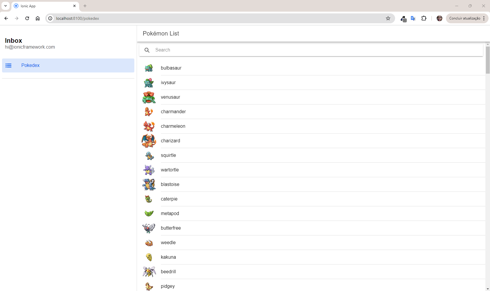
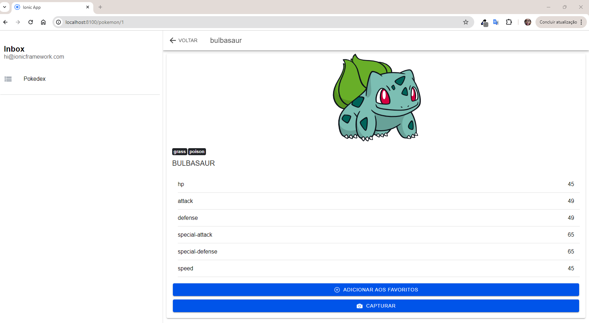
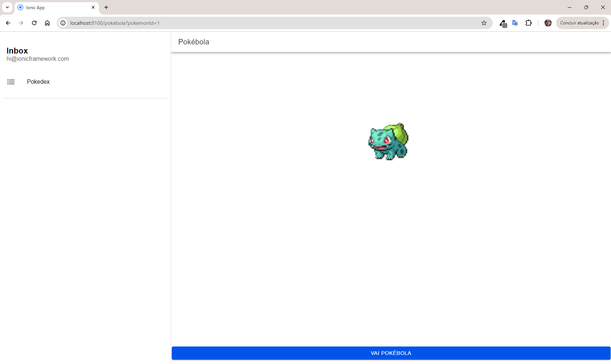
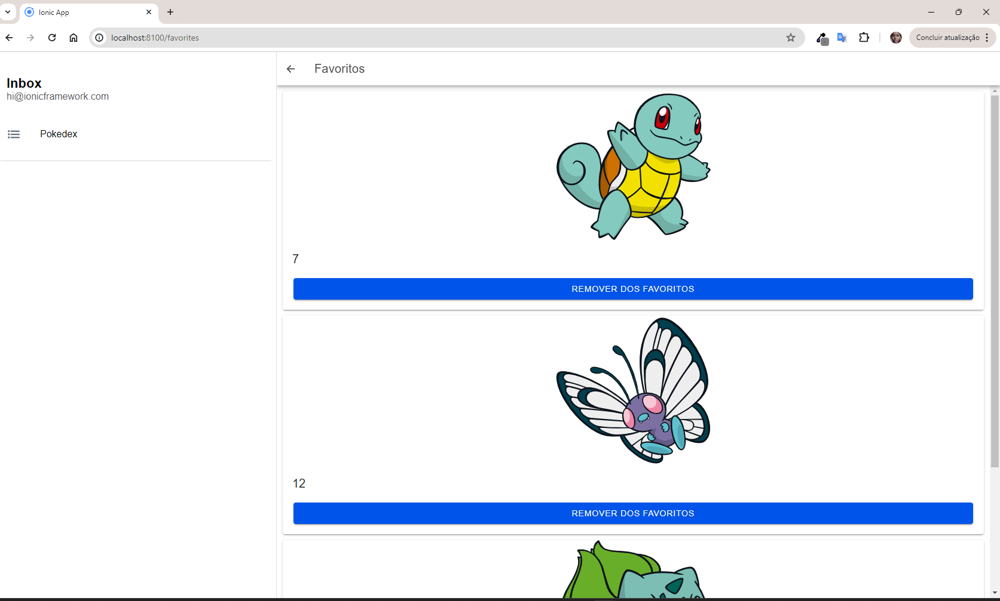

# Pokémon App

## Descrição

Este projeto é um aplicativo de listagem e detalhes de Pokémon usando Ionic e Angular. 

## Abordagem

1. **Componentização**: Componentes reutilizáveis para a tela principal e de detalhes.
2. **Serviços**: Uso de serviços para separar a lógica de negócios.
3. **Favoritos**: Função para marcar Pokémon como favoritos e visualizá-los em uma lista separada.
4. **Capturar**: Função para capturar a imagem do pokémon.
5. **Responsividade**: Adaptação da interface para diferentes orientações de tela.

## Instalação

1. Clone o repositório.
2. Instale as dependências: `npm install`.
3. Execute o projeto: `ionic serve`.

## Uso

Navegue pela lista de Pokémon, visualize detalhes, captura imagem e adicione favoritos.

## Documentação da API

Os serviços estão documentados com comentários JSDoc. Verifique o código para mais detalhes.

## Testes de Unidade

Para rodar os testes de unidade, use o comando:
```bash
npm test

## Apresentação






Para mais detalhes, veja os vídeos demonstrativos:


